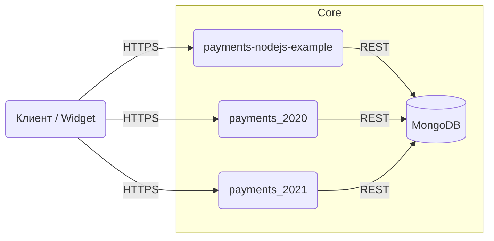

# payments‑webs‑core‑2022 📂💳

> **payments‑webs‑core‑2022** — итоговая «сборка» всех моих экспериментов с платёжными шлюзами за 2020‑2022 гг. Здесь лежат полностью рабочие, но больше не поддерживаемые сервисы (Node.js + Express, MongoDB, QIWI / ЮMoney SDK и небольшие фронт‑dashboard’ы). Проект заморожен и репозиторий переведён в **архив**: код оставлен *as‑is*, без планов на исправления или новые фичи.

---

## 📦 Состав

| Директория | Стек                                                | Краткое описание                                                                                                                  |
| ---------- | --------------------------------------------------- | --------------------------------------------------------------------------------------------------------------------------------- |
| \`\`       | **Node.js 18 + Express 4**, MongoDB, EJS            | Демонстрационная платежная панель и API. Настройки в `config.js`, запуск через `fydne.js` и сервер HTTPS с виртуальным хостингом. |
| \`\`       | Node.js 14, собственный дашборд, QIWI & ЮMoney SDK  | Первая крупная реализация: веб‑виджеты, кастомные курсоры/шрифты, OAuth‑логин и конфиги.                                          |
| \`\`       | Node.js 16, переработанный UI (SVG‑иконки, адаптив) | Рефакторинг фронта и обновление ассетов (visa/mc/qiwi PNG, cursor‑themes.                                                         |

> Все каталоги независимы: каждая версия имеет свои `package.json` / `config.js` и может запускаться отдельно.

---

## 🚀 Быстрый старт (локально)

### 1. payments‑nodejs‑example

```bash
git clone https://github.com/Shiro-nn/payments-webs-core-2022.git
cd payments-webs-core-2022/payments-nodejs-example
npm i
node fydne.js            # HTTP :80, HTTPS :443
```

> Нужно запущенное **MongoDB** (`mongodb://localhost/login`) — см. `config.js`.

### 2. payments\_2020 / payments\_2021

```bash
cd ../payments_2020     # либо ../payments_2021
yarn            # или npm i
node dashboard/app.js
```

* Порты, домены и ключи задаются в соответствующем `config.js`.
* Для HTTPS положите свой сертификат в `dashboard/crt.js` (пример заглушки там же).

---

## 🗺️ Мини‑архитектура



*Каждый сервис сам отвечает за создание счетов, перенаправление на платёжную страницу и callback‑обработку.*

---

## 🛠️ Системные требования

* **Node.js 18+** (2022‑версия), **Node.js 14/16** для старых.
* **MongoDB 4.4+**.
* TLS‑сертификаты для production.

---

## 🤝 Вклад и поддержка

Проект **заморожен** — pull‑request’ы принимаются **только** на критические security‑fix’ы. Если хотите развивать идеи — делайте форк и действуйте свободно!

---

## ⚖️ Лицензия

Код распространяется под лицензией **MIT** (см. `LICENSE`).

> Спасибо за интерес! Пусть этот архив поможет вам быстрее интегрировать платежи в свои проекты.
